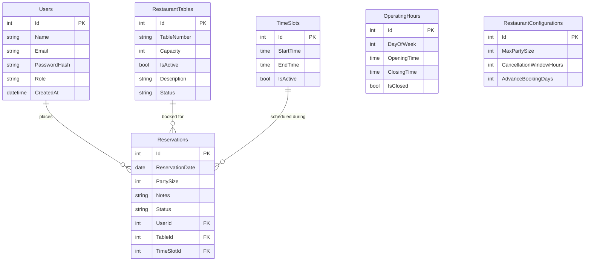

# Database Schema (ER Diagram)

This project uses Entity Framework Core (Code-First approach) with SQL Server. Below is the Entity-Relationship (ER) diagram representing our database schema.

### Table Relationships:
1. **Users ↔ Reservations (1:N):** One user (Customer) can place multiple reservations, but each reservation belongs to exactly one user.
2. **Tables ↔ Reservations (1:N):** One table can be booked multiple times (on different dates/times), but each reservation is tied to a specific table.
3. **TimeSlots ↔ Reservations (1:N):** A specific time slot (e.g., 10:00 AM - 12:00 PM) can have multiple reservations (across different tables), but each reservation is locked to exactly one time slot.

*(Note: EF Core Migrations are already generated and can be found inside the `Migrations/` folder in the source code).*
